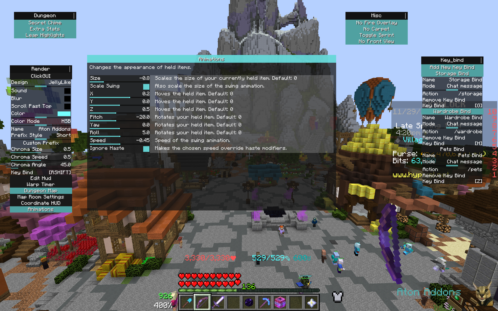

# Aton Addons

A 1.8.9 Minecraft Forge mod for Hypixel Skyblock.

***
<!-- 

  
  
  
  

-->

## Usage
Open the Gui with /atonaddons (or /aa). You can then set a keybind for it in the Click Gui Module.

By default all features will be disabled. 
You can toggle features by left clicking on their corresponding module button in the click gui. 
Right clicking that button will extend the settings for that module.
All modules have a key bind setting, which for most of them will toggle the module. 
But there are a few exceptions where that key bind is used to perform the modules action if it is enabled.

**If you need information on what the module and its settings do middle click the module button and an
advanced settings menu will open.**

Below you can see a preview of the gui.

## Module List

  
Dungeon

### DUNGEON
* Secret Chimes -- Play a sound whenever you get a secret.
* Extra Stats -- Automatically shows extras stats at the end of a dungeon run.
* Leap Highlights -- Highlights chosen target in the Spirit Leap menu.

  
Render

### RENDER
* Click Gui
* Edit Hud
* Dungeon Warp Timer -- A HUD element that shows you the cooldown on dungeon warps.
* Dungeon Map -- A reliable dungeon map.
* Coordinate HUD
* Item Animations -- Change the appearance of held items.
* No Fire Overlay

  
Misc

### MISC
* Toggle Sprint
* Remove Front View -- Skips the front view in the toggle perspective rotation.
+ No Carpet -- Flattens carpet hitboxes in Skyblock to prevent lag back. 

  
Custom Keybindings

### Custom Keybindings
* Command keybindings
* Chat message keybindings

  
Commands

### Commands
* /aa
* 

## Credit to other Projects
A special thank goes to [Harry282](https://github.com/Harry282), his projects allowed me to get started with making my own 
forge mods.
 
[For the list of sources click here.](./USEFUL_SOURCES.md "Credits")